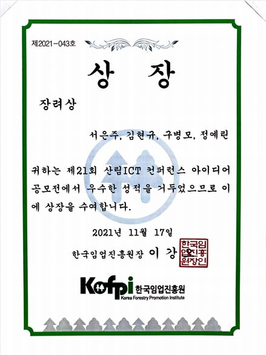

# Forest_ICT

<h2 align="center">⛺제21회 산림 ICT 컨퍼런스  🌳목재 유통 프로세스 Digital Transformation을 위한 블록체인 SCM 플랫폼</h2>

<h2>🌳 1. 개요</h2>

- 공모전: 2021년 산림청에서 주최한 [제21회 산림 ICT 컨퍼런스](https://www.youtube.com/watch?v=3qHR7vAKesQ&ab_channel=%EB%8C%80%ED%95%9C%EB%AF%BC%EA%B5%AD%EC%82%B0%EB%A6%BC%EC%B2%AD)

- 주제: 목재 유통 프로세스 Digital Transformation을 위한 블록체인 SCM 플랫폼

- 수행기간: `2021. 10. 27 ~ 2021. 11. 17`

- 수행인원: 구병모, 서은주, 김현규, 정예린

- 결과 및 성과: `한국임업진흥원상(장려상)`

<h2>🌳 2. 아이디어 개요</h2>

### 목적 및 필요성

- 블록체인 기반 목재 유통 프로세스의 Digital Transformation을 통한 불법 벌채 근절 및 산림생태계 보호

- 가구업계 불법 목재 이슈

- 불법 벌채 목재의 유통

- '합법목재교역촉진제도'의 한계점

#### 추진 배경 및 현황

- 불법벌채는 전 세계 목재 교역량의 30% & 연간 약 1,000억 달러

- 목재 가격 불안정에 따른 목재 수요 예측 실패 및 목재 가격 상승

<h2>🌳 3. 세부 내용</h2>

### 플랫폼 소개

### 핵심 적용 기술

#### 네트워크 정보 원장

- 원산지 정보, 벌채 기록 등의 데이터를 블록에 일괄 저장하여 네트워크 참여자 모두가 공동으로 관리

#### 컨소시움 블록체인

- 분산형 구조를 유지하며 동시에 합의된 이해관계자들의 제한된 참여를 통한 보안 강화

#### 스마트 컨트랙트

- 공인된 제3자 없이 거래의 객관성 및 신뢰성 확보 가능

### 서비스 및 사업성과

#### 합법 목재 인증 과정 일원화

- 플랫폼 내 공유된 데이터 기반 승인 절차 도입

- OCR 도입하여 문서 처리업무 효율성 제고 및 위변조 방지

- 스마트 컨트랙트 활용하여 관세청, 산림청, 검사기관을 거쳐 통관을 신청하는 절차의 간소화

#### 목재 원산지 및 공급망 정보 공유

- 컨소시움 블록체인 기반의 평등한 정보 공유로 불법 행위 예방

#### 소비자 유통 이력 확인

- 소비자 권리 및 선택의 폭 확대

- 기업들 또한 QR코드를 통해 소비자 중심의 마케팅 전략 수립 가능

<h2>🌿 4. 기대효과</h2>

- 정부 / 가구산업계 / 소비자 / 환경으로 나누어 기대효과 설명

<h2>🌿 5. 참고 문헌</h2>

- 양재훈. (2018). 물류산업의 블록체인 적용효과와 법적 과제에 대한 연구. 융합정보논문지, 8(1), 187-198.

- 김철호. (2018). 무역거래에서 블록체인기술의 활용을 위한 해결과제, 무역통상학회지. 8(6), 71-89.

- 안현진. (2021). 국가별 목재합법성 위험 평가. 세계농업, 240(0), 55-79.
